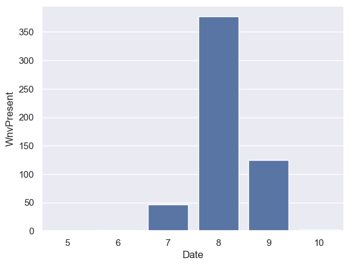
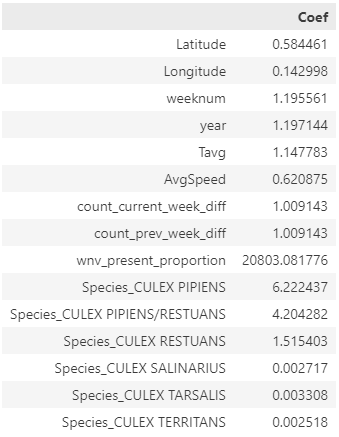

# Project 4: West Nile Virus Disease
## The Problem
As the Chicago Department of Public Health (CDPH) is concerned about the West Nile virus epidemic in Chicago, United States, we are exploring the best approach to prevent such a situation. Initially, we would like to gather data on the following aspects:

> 1. The potential rate of West Nile virus presence in Chicago.
> 2. Where the presence of West Nile virus is observed. We assume that it may originate from one point and then spread to nearby areas.
> 3. When we observed the presence of West Nile virus. We aim to analyze past data to identify the week or month with the highest virus prevalence.

We will use the following data to create a model that can predict the presence of the West Nile virus and derive the best approach from it.

## Data Dictionary
### Train Data
| Data Name | Description | Type | Example |
| --------- | ----------- | ---- | ------- |
| Id | Show ID | String | 123456|
| Date | Show Date | Datetime | 20020-01-01 |
| Address | Approximate Address of the trap location |String | 4100 North Oak |
| Species | Mosquito's Species | String | CULEX |
| Block | Building Block | Integer | 41 |
| Street | Street Name | String | N OAK PARK |
| Trap | Trap Code Number | String | T002 |
| AddressNumberAndStreet | Address and Street | String | 4100 N OAK PARK AVE |
| Latitude | Show Latitude | String | 41.867108 |
| Longitude | Show Longitude | String | -87.654224 |
| count_prev_week_records | Count Virus Present Previous Week | Boolean | 0,1 |
| Wnvpresent | Show West Nile Virus Present | Boolean | 0,1 |

### Weather Data
| Data Name | Description | Type | Example |
| --------- | ----------- | ---- | ------- |
| Station | Show Station Number | String | 1 |
| Date | Show Date | Datetime | 2007-01-01 |
| Tavg | Temperature Average | String | 65 |
| StnPressure | Station Pressure | Float | 22.12 | 
| ResultDir | Show the wind direction | Integer | 23 |
| AvgSpeed | Show Average Wind Speed | Float | 20.5 |

### Spray Data
| Data Name | Description | Type | Example |
| --------- | ----------- | ---- | ------- |
| Date | Show Date | Datetime | 2011-01-01 |
| Latitude | Latitude | float | 42.391623 |
| Longitude | Longitude | float | -88.089163 |

## Exploring the data

This bar graph illustrates the occurrences of West Nile Virus. Three months are highlighted: July, August, and September. August has the highest number of virus instances, with approximately 350 cases, followed by September.

The bar graph displays the number of mosquito species with and without the virus.

This boxplot illustrates the correlation between the presence of the West Nile virus and other factors such as Average Temperature, Total Precipitation, and Station Pressure.

The additional boxplot investigates the relationship between the presence of the West Nile virus and the Resultant Wind Direction, as well as the Average Wind Speed.

## Evaluation and Conceptual Understanding
We have developed models utilizing various algorithms, including `Logistic Regression`, `Random Forest`, `Regularized Greedy Forest (RGF)`, and `XGBoost`. Our experiments involved feature selection and engineering, coupled with hyperparameter tuning, to achieve optimal results in classifying the presence of the West Nile Virus.

### Logictic Regression

### Random Forest

### Regularized Greedy Forest (RGF)

### XGBoost

### Best Model Output
The best model output is Logistic Regression with an accuracy of 0.73 and a recall of 0.75.

The ROC curve for the test data demonstrates that the classifier can effectively discriminate the data. Furthermore, the performance on the validation data closely mirrors that of the training data, indicating that the classifier is not overfitting to the training data.

Inference from the `Logistic Regression` coefficients suggests that if the mosquito species is Culex Pipiens, the probability of West Nile Virus presence is expected to increase by 6.22 times, followed by Culex Pipiens/Restuans at 4.2 and Culex Restuans at 1.5. Additionally, other factors such as average temperature and average wind speed indicate a correlation with the presence of the virus. It can be assumed that hot and dry conditions are more favorable for the West Nile Virus compared to cold and wet conditions.

# In Conclusion
## Cost & Benefit Analysis

The costs associated with the West Nile Virus are categorized into two types: direct costs and indirect costs. Direct costs are those directly attributable to the West Nile Virus, including expenses for pesticide spray and mosquito trapping, medical costs, and funeral expenses. Indirect costs are those not directly caused by WNV but are still associated with the disease, such as the expenses related to vector control and surveillance activities.

From the map visualization above, it is evident that the spray area from the spray dataset covers Chicago. However, the spray does not reach all areas with West Nile virus presence (yellow spots). This suggests that the current solution may not be highly effective. It's important to note that mosquitoes carrying the virus might potentially fly away from the spray area. Additionally, pesticides, while a common preventive measure, are not always effective and can have negative environmental and health effects. In certain instances, the use of pesticides may even increase the risk of West Nile Virus transmission by selecting for pesticide-resistant mosquitoes.

### Suggestion

As observed in the visualization above, colors without opacity represent locations that have been sprayed, while the circles denote areas with mosquito presence—where the size of the circle corresponds to the mosquito count. Yellow circles indicate the presence of the West Nile virus in the mosquitoes.

Rather than randomly spraying areas, we recommend that the Chicago Department of Public Health (CDPH) utilizes the predictive model to strategically deploy officers for spraying. This approach aims to optimize the use of resources by targeting areas predicted to have a higher risk of West Nile virus transmission based on the model's insights.

The table above presents the utilization of the predictive model based on the 2014 predictions in the test data, employing various probability thresholds to predict the presence of the West Nile virus. By adjusting this threshold percentage, we can explore different approaches and identify the most balanced cost-benefit trade-off—considering the number of locations to be sprayed versus the percentage of potentially missed locations with the West Nile virus.