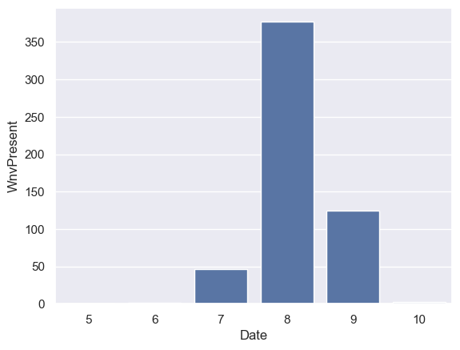
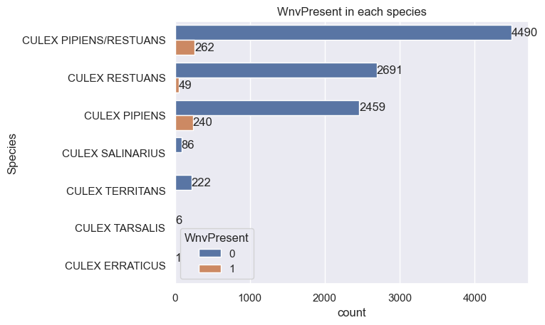
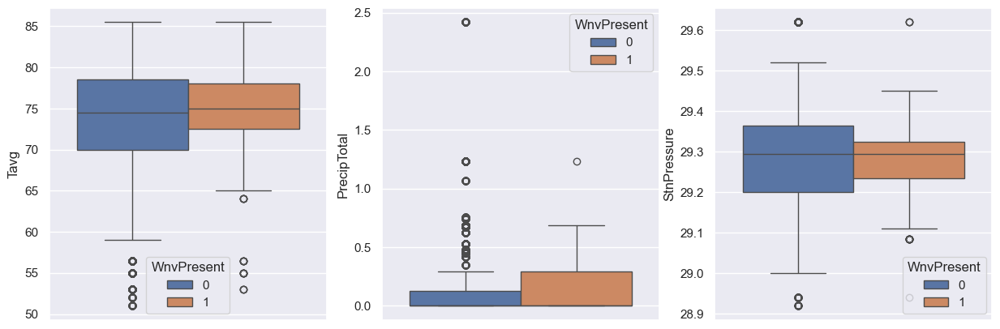
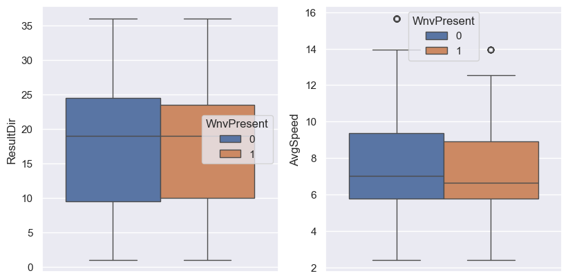
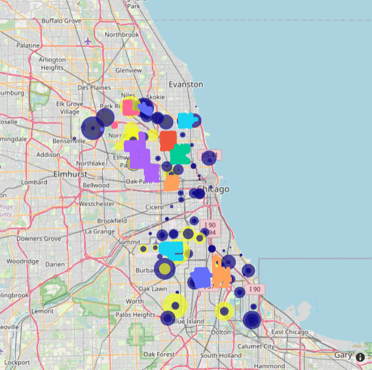

# Project 4: West Nile Virus Disease
## Problem Statement
Chicago Health Public concerns West Nile virus epidemic in Chicago, United State. We are finding volunteers as doctors, nurses, and any medical volunteers who would like to help West Nile Virus patients. But first, we would like to know the data which can inform in this following:
> 1. How possible rate in West Nile Present in Chicago?
> 2. Where is West Nile present? We assume that there are potential patients there.
> 3. When did West Nile present? We can compare date data which date is the highest virus present.

## Data Dictionary
### Train Data
| Data Name | Description | Type | Example |
| --------- | ----------- | ---- | ------- |
| Id | Show ID | String | 123456|
| Date | Show Date | Datetime | 20020-01-01 |
| Address | Approximate Address of the trap location |String | 4100 North Oak |
| Species | Mosquito's Species | String | CULEX |
| Block | Building Block | Integer | 41 |
| Street | Street Name | String | N OAK PARK |
| Trap | Trap Code Number | String | T002 |
| AddressNumberAndStreet | Address and Street | String | 4100 N OAK PARK AVE |
| Latitude | Show Latitude | String | 41.867108 |
| Longitude | Show Longitude | String | -87.654224 |
| count_prev_week_records | Count Virus Present Previous Week | Boolean | 0,1 |
| Wnvpresent | Show West Nile Virus Present | Boolean | 0,1 |

### Weather Data
| Data Name | Description | Type | Example |
| --------- | ----------- | ---- | ------- |
| Station | Show Station Number | String | 1 |
| Date | Show Date | Datetime | 2007-01-01 |
| Tavg | Temperature Average | String | 65 |
| StnPressure | Station Pressure | Float | 22.12 | 
| ResultDir | Show the wind direction | Integer | 23 |
| AvgSpeed | Show Average Wind Speed | Float | 20.5 |

### Spray Data
| Data Name | Description | Type | Example |
| --------- | ----------- | ---- | ------- |
| Date | Show Date | Datetime | 2011-01-01 |
| Latitude | Latitude | float | 42.391623 |
| Longitude | Longitude | float | -88.089163 |

## Exploratory Data Analysis

This bar graph shows that the number of West Nile Virus appeared. There are 3 months have shown which are July, August, and September. August has the highest number of virus which is approximately 350 presents, followed by September.

The bar graph shows the number of mosquito's species which have virus or not. 

This boxplot shows correlate between West Nile Present Virus and other factors (Temperature Average, Total Preciptation, Station Pressure)

Another boxplot mentioned about Resultant Wind Direction and Average Wind Speed. 

## Error Analysis

# In Conclusion
## Cost & Benefit Analysis
Chicago Health Public has look through the analysis from West Nile Virus. We would like to announce what citizen have to do next. First of all, the Chicago Health Public has to conduct infection prevention and control (IPC) in the context of West Nile Virus in this following:
- Avoid mosquito bites by using insect repellent, wearing long sleeves and pants, and staying indoors during peak mosquito hours.
- If citizen does not have important things to do, please stay at home
- Prepare medicines if possible when citizen infected
- Eliminate mosquito breeding grounds around your home by emptying containers of standing water
- Report dead birds to your local health department

### Cost
There are costs of West Nile Virus divided by two types: direct and indirect costs. Direct costs are those that can be directly attributed to West Nile Virus, expecially, pesticide spray and trap for preventing mosquitoes, medical expense, and funeral expenses. Indirect costs are those that are not directly caused by WNV, but are still associated with the disease, such as the cost of vector control and surveillance activities.

From map visualized above, the spray area from spray dataset is covered from Chicago. However, the spray is not covered all the West Nile present (yellow spot). That's mean this solution is not effective much, but not least because we can assume that when there are possible mosquitoes which have virus fly away from spray area. Plus, pesticides are not always effective, and they can also have negative environmental and health effects. In some cases, the use of pesticides may actually increase the risk of WNV transmission by selecting for pesticide-resistant mosquitoes.

### Benefit
- Reduced risk of WNV transmission: Pesticides can help to reduce the number of mosquitoes that are able to transmit WNV, which can lead to a lower incidence of WNF.
- Protection of public health: WNV can cause serious illness and death, so reducing the risk of transmission can help to protect public health
- Economic benefits: WNV can have a significant economic impact, due to the costs of medical care and lost productivity. Preventing WNV transmission can help to reduce these economic costs

