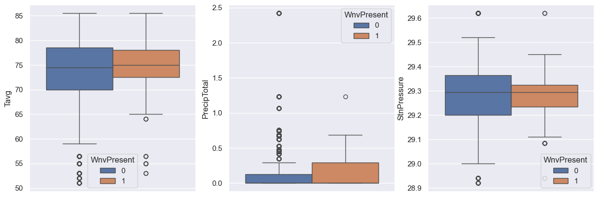
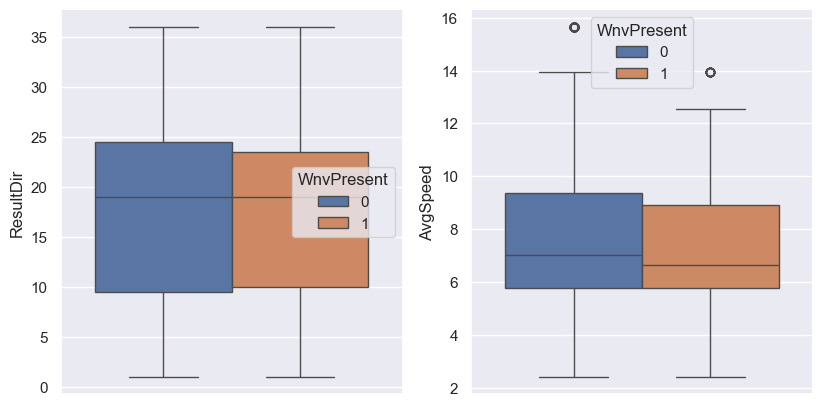

# Project 4: West Nile Virus Disease
## The Problem
As the Chicago Department of Public Health (CDPH) is concerned about the West Nile virus epidemic in Chicago, United States, we are exploring the best approach to prevent such a situation. Initially, we would like to gather data on the following aspects:

> 1. The potential rate of West Nile virus presence in Chicago.
> 2. Where the presence of West Nile virus is observed. We assume that it may originate from one point and then spread to nearby areas.
> 3. When we observed the presence of West Nile virus. We aim to analyze past data to identify the week or month with the highest virus prevalence.

We will use the following data to create a model that can predict the presence of the West Nile virus and derive the best approach from it.

## The Data
### Train Data
| Data Name | Description | Type | Example |
| --------- | ----------- | ---- | ------- |
| Id | Show ID | String | 123456|
| Date | Show Date | Datetime | 20020-01-01 |
| Address | Approximate Address of the trap location |String | 4100 North Oak |
| Species | Mosquito's Species | String | CULEX |
| Block | Building Block | Integer | 41 |
| Street | Street Name | String | N OAK PARK |
| Trap | Trap Code Number | String | T002 |
| AddressNumberAndStreet | Address and Street | String | 4100 N OAK PARK AVE |
| Latitude | Show Latitude | String | 41.867108 |
| Longitude | Show Longitude | String | -87.654224 |
| count_prev_week_records | Count Virus Present Previous Week | Boolean | 0,1 |
| Wnvpresent | Show West Nile Virus Present | Boolean | 0,1 |

### Weather Data
| Data Name | Description | Type | Example |
| --------- | ----------- | ---- | ------- |
| Station | Show Station Number | String | 1 |
| Date | Show Date | Datetime | 2007-01-01 |
| Tavg | Temperature Average | String | 65 |
| StnPressure | Station Pressure | Float | 22.12 | 
| ResultDir | Show the wind direction | Integer | 23 |
| AvgSpeed | Show Average Wind Speed | Float | 20.5 |

### Spray Data
| Data Name | Description | Type | Example |
| --------- | ----------- | ---- | ------- |
| Date | Show Date | Datetime | 2011-01-01 |
| Latitude | Latitude | float | 42.391623 |
| Longitude | Longitude | float | -88.089163 |

## Exploring the data

This bar graph illustrates the occurrences of West Nile Virus. Three months are highlighted: July, August, and September. August has the highest number of virus instances, with approximately 350 cases, followed by September.

The bar graph displays the number of mosquito species with and without the virus.

This boxplot illustrates the correlation between the presence of the West Nile virus and other factors such as Average Temperature, Total Precipitation, and Station Pressure.

The additional boxplot investigates the relationship between the presence of the West Nile virus and the Resultant Wind Direction, as well as the Average Wind Speed.

## Error Analysis

# In Conclusion
## Cost & Benefit Analysis
The Chicago Department of Public Health has reviewed the analysis of the West Nile Virus. We would like to announce the necessary actions for citizens to take:

- **Avoid mosquito bites**: Use insect repellent, wear long sleeves and pants, and stay indoors during peak mosquito hours.

- **Stay at home when not essential**: If citizens do not have essential tasks, please remain at home.

- **Prepare medicines**: Take necessary precautions, such as preparing medicines, in case of infection.

- **Eliminate mosquito breeding grounds**: Empty containers of standing water to prevent mosquito breeding around your home.

- **Report dead birds**: Report any sightings of dead birds to your local health department.

These measures are part of our infection prevention and control (IPC) strategy in the context of the West Nile Virus.

### Cost
The costs associated with the West Nile Virus are categorized into two types: direct costs and indirect costs. Direct costs are those directly attributable to the West Nile Virus, including expenses for pesticide spray and mosquito trapping, medical costs, and funeral expenses. Indirect costs are those not directly caused by WNV but are still associated with the disease, such as the expenses related to vector control and surveillance activities.

From the map visualization above, it is evident that the spray area from the spray dataset covers Chicago. However, the spray does not reach all areas with West Nile virus presence (yellow spots). This suggests that the current solution may not be highly effective. It's important to note that mosquitoes carrying the virus might potentially fly away from the spray area. Additionally, pesticides, while a common preventive measure, are not always effective and can have negative environmental and health effects. In certain instances, the use of pesticides may even increase the risk of West Nile Virus transmission by selecting for pesticide-resistant mosquitoes.

### Benefit
- **Reduced risk of WNV transmission**: Pesticides can contribute to diminishing the number of mosquitoes capable of transmitting WNV, thereby lowering the incidence of West Nile Fever.

- **Protection of public health**: Given that WNV can result in severe illness and fatalities, mitigating the risk of transmission through the use of pesticides is crucial for safeguarding public health.

- **Economic benefits**: WNV can impose substantial economic burdens due to medical care expenses and lost productivity. By preventing the transmission of WNV, the associated economic costs can be reduced.
